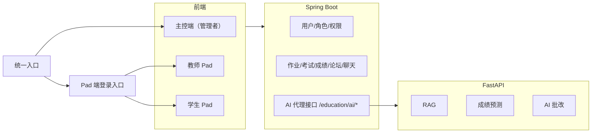

# 基于 RAG 的个性化智能教育辅助系统

本项目是一个面向高校场景的智能教育平台，围绕“AI 赋能学生学业、AI 减负教师教学”建设，当前采用三层协同架构：

- `frontend`：Vue 3 + Vite 前端
- `backend`：Spring Boot 业务后端
- `ai_service`：FastAPI AI 服务

当前项目已经完成主控端与 Pad 端分离：

- 主控端：面向管理者，负责全局成绩、任务下发、入口管理
- 教师 Pad：面向老师，负责作业、考试、学情分析、AI 批改、教学问答
- 学生 Pad：面向学生，负责作业提交、考试成绩、学习规划、学业诊断、资料整理、智能刷题

## 系统架构



## 当前功能

### 管理者

- 查看全局成绩概览
- 创建老师任务
- 创建学生作业任务
- 从主控端进入老师 Pad / 学生 Pad

### 教师 Pad

- 登录/注册
- 发布作业、发布考试
- 查看作业提交与考试成绩
- 作业批改、考试评分
- 班级学情分析
- 教学问答与政策咨询
- 智能题库与试卷生成
- AI 作业 / 实验报告批改
- 聊天与论坛

### 学生 Pad

- 登录/注册
- 查看作业并提交
- 查看个人考试成绩
- 个性化学习规划
- 多维度学业诊断报告
- 课程资料智能整理与知识点提取
- 智能习题生成与个性化刷题推荐
- AI 学习助手
- 聊天与论坛

## 目录结构

```text
.
├─ frontend/
│  ├─ src/views/education/
│  │  ├─ admin/
│  │  ├─ teacher/
│  │  ├─ student/
│  │  └─ pad.vue
│  ├─ src/api/education/
│  └─ src/router/education/
├─ backend/
│  ├─ ruoyi-admin/
│  └─ zhiyu/
│     ├─ src/main/java/com/ruoyi/student/controller/
│     └─ src/main/resources/
├─ ai_service/
└─ deploy/
   └─ ENVIRONMENT.md
```

## 关键约束

项目当前按 [AGENTS.md](/E:/education-platform/AGENTS.md) 执行，核心规则如下：

- 主控端与 Pad 端严格分离
- 管理者、老师、学生权限严格隔离
- Spring Boot 负责业务与鉴权
- FastAPI 仅负责 AI 能力
- 前端页面不直接散写请求，统一走 `frontend/src/api`

## 接口链路

当前推荐调用链是：

1. 前端请求 Spring Boot
2. Spring Boot 处理业务权限
3. Spring Boot 代理调用 FastAPI

AI 代理入口：

- `/education/ai/rag/*`
- `/education/ai/prediction/*`
- `/education/ai/grading/*`

不再推荐前端直接访问 `http://127.0.0.1:8000`

## 本地启动

### 1. 准备依赖

- JDK 8
- Maven
- MySQL 5.7+/8.0+
- Redis
- Node.js 18+
- Python 3.13+
- `uv`

### 2. 配置环境变量

先参考：

- [.env.example](/E:/education-platform/.env.example)
- [ai_service/.env.example](/E:/education-platform/ai_service/.env.example)
- [ENVIRONMENT.md](/E:/education-platform/deploy/ENVIRONMENT.md)

最关键的是：

```env
EDUCATION_AI_BASE_URL=http://127.0.0.1:8000
```

### 3. 启动 AI 服务

```powershell
cd E:\education-platform\ai_service
uv sync
uv run uvicorn main:app --reload --host 0.0.0.0 --port 8000
```

### 4. 启动 Spring Boot

```powershell
cd E:\education-platform\backend
mvn clean install -DskipTests
cd E:\education-platform\backend\ruoyi-admin
mvn spring-boot:run
```

### 5. 启动前端

```powershell
cd E:\education-platform\frontend
npm install
npm run dev
```

## 常用地址

- 前端：`http://localhost`
- Spring Boot：`http://localhost:8080`
- FastAPI Docs：`http://localhost:8000/docs`

## 相关文档

- 环境变量与部署说明：[ENVIRONMENT.md](/E:/education-platform/deploy/ENVIRONMENT.md)
- 后端启动说明：[README-启动说明.md](/E:/education-platform/backend/README-%E5%90%AF%E5%8A%A8%E8%AF%B4%E6%98%8E.md)
- 项目规则：[AGENTS.md](/E:/education-platform/AGENTS.md)
