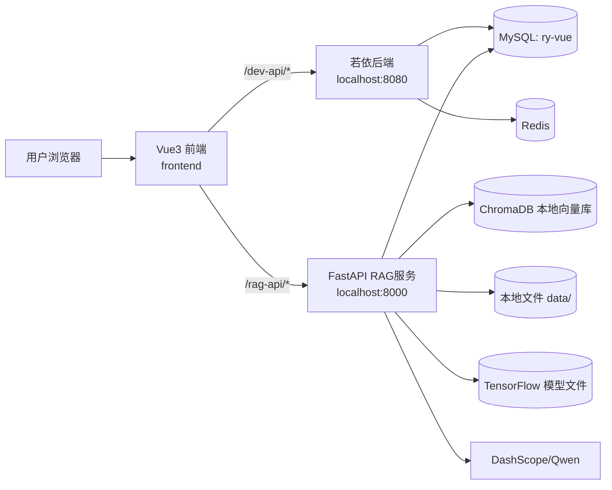

# 整体框架说明

本文档用于快速理解本仓库的架构、调用链、数据流与扩展点，便于后续查询与维护。

## 1. 总体架构

本项目是典型的“三服务协同”架构：

- 管理后台（Java / Spring Boot / RuoYi）
- 业务前端（Vue3 / Vite）
- AI 服务（Python / FastAPI）

## 2. 分层职责

### 2.1 前端层（`frontend`）

- 页面层：`src/views/education/`
  - `dashboard.vue`：教育首页
  - `index.vue`：学生成绩管理
  - `rag.vue`：RAG 上传与问答
  - `prediction.vue`：模型训练、模型信息、成绩预测
- 路由层：`src/router/education/index.js`
- API 层：`src/api/education/*.js`
- 代理层：`vite.config.js`
  - `/dev-api` 代理到 `8080`
  - `/rag-api` 代理到 `8000`

### 2.2 业务后端层（`backend`）

- 主服务入口：`ruoyi-admin`
- 学生成绩业务模块：`zhiyu`
  - Controller：`StudentPerformanceController`
  - Service：`StudentPerformanceServiceImpl`
  - Mapper：`StudentPerformanceMapper` + XML
- 基础能力：鉴权、日志、分页、代码生成、定时任务等（若依标准模块）

### 2.3 AI 服务层（`ai_service`）

- `main.py`：FastAPI 路由聚合
- `rag_service.py`：Excel 解析、向量入库、问答生成、数据集管理
- `prediction_service.py`：模型训练、预测、模型信息
- `database.py` + `models.py`：RAG 元数据表（`rag_dataset`）

## 3. 关键业务流程

### 3.1 学生成绩 CRUD（走若依）

1. 前端页面 `education/index.vue` 调用 `src/api/education/index.js`
2. 请求进入 `/student/performance/**`
3. `StudentPerformanceController` 处理并调用 Service/Mapper
4. MySQL `student_performance` 表返回结果

### 3.2 RAG 文件上传与问答（走 FastAPI）

1. 前端 `education/rag.vue` 上传 Excel 到 `/rag-api/upload-excel`
2. FastAPI 将文件存入 `ai_service/data/`
3. `RAGService.process_excel()` 解析行文本并写入 ChromaDB
4. 同步写入 MySQL 表 `rag_dataset`（记录文件元信息）
5. 问答时调用 `/rag-api/query`
6. `RAGService.query_answer()` 从向量库召回上下文并调用 Qwen 生成答案

### 3.3 预测训练与推理（走 FastAPI）

1. 前端 `education/prediction.vue` 上传 CSV 到 `/rag-api/train-prediction-model`
2. `PredictionService.train_model_from_csv()` 完成预处理 + 训练 + 保存模型
3. 产物落盘到 `ai_service/models/`
4. 调用 `/rag-api/predict-score` 读取模型与标准化器进行预测

## 4. 数据与存储

- MySQL（`ry-vue`）
  - 若依系统表（用户、角色、菜单等）
  - `student_performance`（学生成绩主业务表）
  - `rag_dataset`（RAG 文件元数据表）
- Redis
  - 若依登录态、缓存等
- 本地文件
  - `ai_service/data/`：上传后的 Excel 数据源
  - `ai_service/chroma_db/`：向量索引
  - `ai_service/models/`：预测模型与预处理器

## 5. 接口域划分

- 后端业务域（若依，`8080`）
  - `/student/performance/**`
- AI 能力域（FastAPI，`8000`）
  - `/upload-excel`
  - `/query`
  - `/datasets` 与 `/rag-api/datasets`（兼容别名）
  - `/train-prediction-model`
  - `/predict-score`
  - `/model-info`

## 6. 配置耦合点（重点关注）

- 前端端口与代理：`frontend/vite.config.js`
- 若依数据库与 Redis：`backend/ruoyi-admin/src/main/resources/application*.yml`
- RAG MySQL 连接：`ai_service/database.py`
- RAG LLM 凭证：`ai_service/rag_service.py`

## 7. 当前架构特点与改进方向

### 7.1 特点

- 实现快，适合课程/实验型项目快速落地
- RAG 与管理后台解耦，便于独立演进
- 前端统一入口，用户体验连续

### 7.2 建议改进

- 把 RAG 服务中的密钥和数据库连接改为环境变量配置
- 将 FastAPI 接口统一加鉴权（与若依 token 对齐）
- 增加 `student_performance` 和 `rag_dataset` 的标准建表脚本
- 增加 Docker Compose，一键拉起 MySQL/Redis/Java/Python/前端
- 为 RAG 与预测服务补充健康检查与监控指标

## 8. 查询导航（给后续 AI/开发用）

- 查“页面入口”：先看 `frontend/src/router/education/index.js`
- 查“页面调了哪个接口”：看 `frontend/src/api/education/*.js`
- 查“学生成绩接口实现”：看 `backend/zhiyu/src/main/java/com/ruoyi/student/controller/StudentPerformanceController.java`
- 查“学生表 SQL 字段”：看 `backend/zhiyu/src/main/resources/mapper/student/StudentPerformanceMapper.xml`
- 查“RAG 接口实现”：看 `ai_service/main.py`
- 查“问答逻辑”：看 `ai_service/rag_service.py`
- 查“预测逻辑”：看 `ai_service/prediction_service.py`
